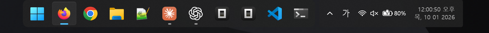
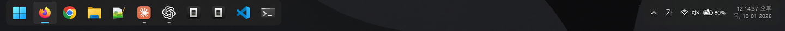

# windhawk-floating-dock

[한국어](README.ko.md)

A floating, auto-hiding Windows 11 taskbar that is kind to OLED screens:
a rounded dock and tray that slide in smoothly, pop slightly as they land, and
leave nothing on screen while hidden. Built from two
[Windhawk](https://windhawk.net) mods and presets for
[Windows 11 Taskbar Styler](https://windhawk.net/mods/windows-11-taskbar-styler).

| Part | What it does |
| --- | --- |
| [Taskbar Auto-Hide Motion](mods/taskbar-autohide-motion.wh.cpp) | Smooth slide and pop for the auto-hidden taskbar, fully invisible while hidden (no 1-2 px strip left on screen), reveal along the whole bottom edge, configurable delays. Works with any taskbar style. |
| [Floating Dock Helpers](mods/floating-dock-helpers.wh.cpp) | macOS-style layout (tray right next to the centered dock), hot corners for Start and Show desktop, Quick Settings opening above the moved tray. |
| [Styler presets](styler-presets) | The floating dock itself: rounded dock and tray with gaps around them, and empty taskbar space that passes clicks through. |

## Layouts

| Layout | Windows taskbar alignment | Styler preset | Helpers: *Tray next to the dock* |
| --- | --- | --- | --- |
| **mac** (dock and tray side by side, centered together) | Center | `taskbar-styler-mac.json` | On |
| **left** (dock pushed to the left edge, tray to the right edge) | Left | `taskbar-styler-left.json` | Off |

**mac**

**left**

## Requirements

- Windows 11. Tested on **25H2 (build 26200) at 175% scaling** with
  Windhawk 1.7.3. Other builds may work; a feature whose taskbar internals
  can't be found is turned off instead of breaking the taskbar.
- Taskbar at the bottom. Hot corners, the whole-edge reveal and the mac
  layout cover the primary monitor.

## Install

1. Install [Windhawk](https://windhawk.net).
2. In Windhawk, install **Windows 11 Taskbar Styler** and **Taskbar height
   and icon size** from *Explore*.
3. Apply the presets. For each of the two mods: open it, go to
   **Advanced > Mod settings**, paste the preset file's contents and click
   **Save**.
   - Taskbar Styler: `taskbar-styler-mac.json` (mac) or
     `taskbar-styler-left.json` (left).
   - Taskbar height and icon size: `taskbar-icon-size.json` (72 px taskbar,
     28 px icons; the Styler margins are tuned for this height).

   **Save replaces all of that mod's settings.** Click **Load** first and
   keep the text if you want to go back.
4. Install the two mods. For each `.wh.cpp` file in [mods](mods): in Windhawk
   click **Create a New Mod**, replace the whole template with the file's
   contents, click **Compile Mod**, then **Exit Editing Mode**.
5. Choose the layout in Floating Dock Helpers: enable *Tray next to the dock*
   for mac, or disable it for left. Windows taskbar alignment is set
   automatically to Center or Left respectively.
6. Turn on **Automatically hide the taskbar** (same page).

Both presets pin the padding inside the Start button. Windows sets it when
Explorer starts (10 DIP wider on the left with left alignment), so without
this the dock would only look right after a sign-out; with it, switching
layouts takes effect right away.

## Panel behavior (1.0.5)

Install both local mods at version 1.0.5 for the shared panel behavior.

- Clicking another dock panel button once replaces Start, Search, Quick
  Settings, Notifications/calendar or the hidden-icons panel.
- The dock stays visible while a panel is open, including transitions and
  Quick Settings subpages. Moving the cursor away does not close it.
- An outside click or Escape on the main panel closes it and releases the
  dock to its usual hide animation. Escape in Wi-Fi, Bluetooth or audio
  output lists returns to the Quick Settings main page.
- A tray icon's menu stays associated with the hidden-icons panel; Escape
  closes the menu first. Task View follows Windows' native visibility policy.
- Enabling the macOS layout sets Windows alignment to Center; disabling it
  sets alignment to Left. No additional option is required.

These rules were verified for dock button entry on the primary, bottom
taskbar on build 26200. Keyboard shortcuts such as Win+A/Win+N use Windows'
native fallback; the single-panel policy is not guaranteed for those entry
paths. See [verification results](docs/verification-1.0.5.txt).

## Settings

**Taskbar Auto-Hide Motion**

- *Motion profile*: Smooth, Expressive (overshoot and settle) or Expressive
  scale (pop on arrival, default).
- Reveal / hide durations, overshoot, pop size, pop spring duration and bounce.
- *Transparent while hidden*: hides the strip Windows leaves on screen.
- Reveal / hide delays.
- *Reveal along the whole bottom edge*: needed with the click-through option,
  which otherwise reveals the taskbar only below the dock and the tray.
- *Respect Windows animation effects*.

**Floating Dock Helpers**

- *Tray next to the dock (macOS style)* and the gap between them.
- *Hot corners*: clicking the bottom left corner opens Start, the bottom
  right shows the desktop. Their size is measured from the dock and the
  tray; they exist only while the taskbar is shown and floats above the
  screen edge.

Both mods have a *Diagnostic trace file* option that writes what they do to
`%TEMP%` (`taskbar-autohide-motion.log`, `floating-dock-helpers.log`).
Attach it to bug reports.

## Uninstall

Disable or remove the mods in Windhawk. Restore your previous Taskbar Styler
and Taskbar height and icon size settings (step 3), or remove those mods.

## How it works

- The slide animates the taskbar's own XAML content with the Composition
  API; the native window is only moved while the content is off screen or
  transparent, so there are no handoff flashes.
- Taskbar Styler re-applies the margins and alignment it styles, so the mac
  layout moves the dock and the tray with a RenderTransform. Styler's
  click-through region is measured with `TransformToVisual`, which only sees
  a new transform once it has been rendered; the helpers wait for that and
  then trigger a layout pass so the region never cuts the dock.
- The whole-edge reveal calls Windows' own `TrayUI::Unhide` with the
  arguments of a mouse reveal when the cursor rests on the bottom edge
  outside the click-through region (never over full screen windows).

## Credits

Patterns for intercepting `TrayUI::SlideWindow`, the auto-hide timers and
retrieving the taskbar's XamlRoot are adapted from GPLv3 mods in
[ramensoftware/windhawk-mods](https://github.com/ramensoftware/windhawk-mods).
Thanks to m417z for Windhawk and Windows 11 Taskbar Styler.

## License

[GPL-3.0](LICENSE)
